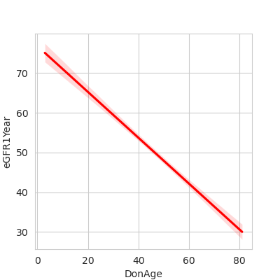

# Machine Learning Does Not Outperform Traditional Statistical Methods
Kidney Transplantation is a life-changing procedure that increases a patient’s
lifespan for decades. Acute rejection is the primary risk factor and incurs significant
costs to human life and the healthcare system. Kidney donations are in short
supply, so each one must be allocated carefully. Machine learning models have been
developed to predict graft survival to aid decision-making in clinical practice. To
date, they have not outperformed traditional statistical methods and have generally
suffered from insufficient evaluation. We proposed a novel strategy using a
cluster-then-predict framework by utilising a large dataset of over 2500 kidney
transplants containing donor and recipient characteristics and transplant factors. 

## Key Insights
- We compared 3 methods of prediction and **found no significant differences** between the three methods as described below:
  1. A traditional statistical method using linear regression
  2. A machine learning method using XGBoost
  3. A *"Cluster-Then-Predict"* method using mixture models and XGBoost
- Therefore, the distinct value of applying machine learning approaches to this problem requires further justification. 
- We identified kidney donor age as the principal variable in predicting kidney transplant survival outcomes. A younger donor is associated with more positive clinical outcomes. Therefore, an older donor is associated with a lower estimated Glomerular Filtration Rate (a measure of kidney function). The visual below illustrates this inverse relationship.

#### The relationship between Donor Age and estimated Glomerular Filtration Rate levels at 1-year post kidney transplant (eGFR at 1 year)
There is a drop in 0.583 eGFR units for every 1-year increase in Donor Age. eGFR at 1-year post transplant, measured on a 0 to 120 scale, drops from 65 (mildly dysfunctional) for a 20-year-old donor to 30 (severely dysfunctional) for an 80-year-old donor.
.
- The *"Cluster-Then-Predict"* method involves first clustering the kidney transplant data and then applying a separate machine learning algorithm to each individual cluster. This framework assumes that within a transplant cohort, there are distinct phenotypes that possess differing feature importance when predicting a target variable (Survival after 1 year).
- During the development of our clinical prediction models we performed a thorough literature review as well as consulting with kidney transplant domain experts from Beaumont Hospital and Royal College of Surgeons Ireland. We worked with these clinicians throughout the project, they aided us in interpreting the generated clusters and we sought their opinions during the feature engineering and feature selection phases.
- The project was developed using Python, for cleaning, processing, and prediction, and R, for missing data imputation and implementing mixture models.
- All work was performed in a high-performance cluster environment using Slurm, a workload manager.

## Overview

This repository documents Aoife McDaid and Diarmuid Brady's final year project.

Our final report submission can be found here [Final Report](reports/deliverables/Final_Report.pdf).

You can learn more about the project using the [research proposal](reports/deliverables/research_proposal.pdf).

The repository follows the file structure from [nbdev](https://nbdev.fast.ai/)

Branch names follow the conventions outlined in this [DeepSource Article](https://deepsource.io/blog/git-branch-naming-conventions/).

## File Structure
The repository has six main directories; data, docs, environments, kidney_tranplant_prediction, nbs, and reports.

### data
The data is not present on GitHub for GDPR and access reasons.

However, the _data_ directory consists of three directories; _raw_, _interim_, and _proc_. _Raw_ contains the raw data and is never touched. _interim_ is a copy of _raw_ and it contains data that is allowed to be manipulated. When the data from _interim_ has been processed, it is saved in the _proc_ directory. _proc_ must only contain data that is processed.

### docs 
_docs_ contains relevant documentation on how the code works or how to use certain modules created.

### environments
_environments_ contains the environment files used to aid the reproducibility of analysis. It also contains a file used for setting up Jupyter Lab on the high-performance cluster.

### kidney_tranplant_prediction
This includes a number of importable Python functions and variables exported from the _nbs_ directory. The file names are generated from the comment in the top cell of a notebook.
```
# default exp *name*
```
Then all the code in files can be found in the cells with `#| export` at the top.

### nbs
_nbs_ contains all notebooks used for analysis. These notebooks are then converted to Python files available in _kidney\_transplant\_prediction_ as importable files.

### reports
_reports_ contain a variety of supporting documents. Firstly, _deliverables_ contain documents that are specific to the grading of our project such as the [research proposal](reports/deliverables/research_proposal.pdf) and [final report](reports/deliverables/CA4021_Final_Report.pdf). _figures_ includes all visualisations generated during analysis. This will not be an exhaustive list, instead only the key visuals needed for supporting documents.
